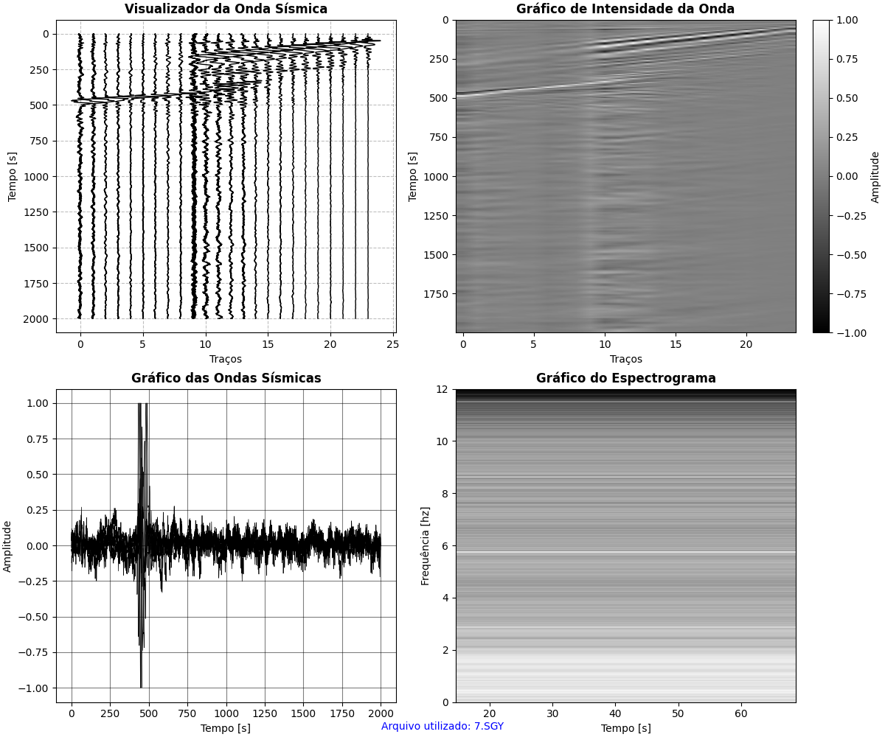
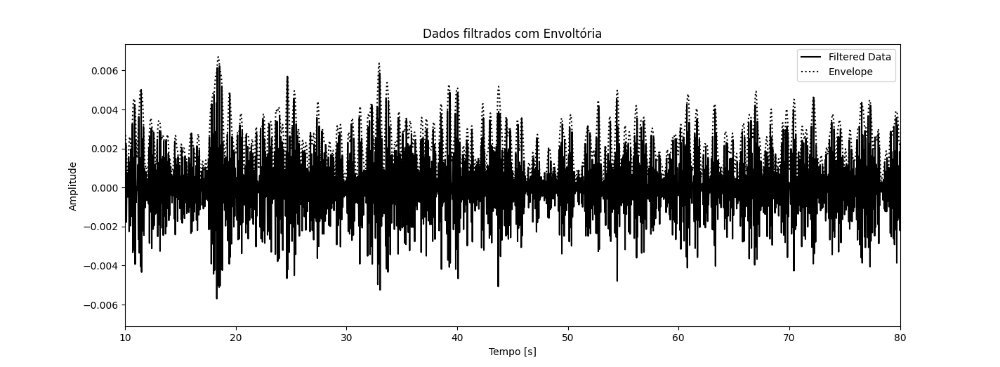
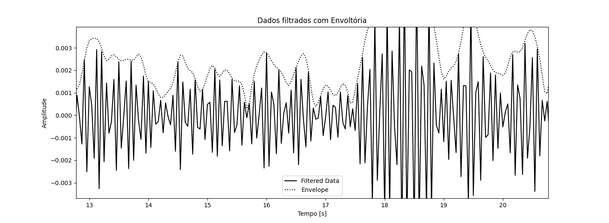

# SEis-View
A Visualization of Seismic Data in SEGY. A Useful project for a quick view in Group Works or other stuff. 

## Useful for: 

- Interactive visualization of seismic data
- Support for multiple data file formats
- Friendly and intuitive interface
- Data analysis and comparison tools

## Examples:

> A plot of Seismic Data. 

> A filter of Wavelet views. 

